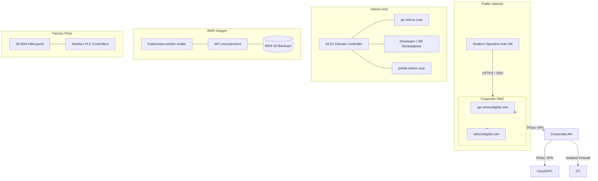

# Veloce Digital Systems (VDS) — Vulnerable Enterprise Blueprint

This blueprint describes the fictional enterprise architecture, network topology, active directory structure, technology stack, and asset mapping for **Veloce Digital Systems (VDS)** (established in 1965 as *Veloce Heavy Industries*). This enterprise serves as the single hosting architecture for all current and future labs in the HackerPlus platform.

---

## 1. Company Overview

Veloce Digital Systems is a legacy heavy industrial manufacturing, defense contractor, and logistics corporation that has undergone a rapid "digital transformation" over the last two decades. 
Because of acquisitions, legacy contracts, and rushed cloud migrations, VDS runs a hybrid infrastructure with layers of technology spanning from 1965 mainframe services to modern containerized microservices and AI integrations.

### Key Timelines & Tech Heritage:
*   **1965 – 1985 (Legacy Core)**: Mainframe COBOL inventory trackers, proprietary serial protocols, and early Unix server installations.
*   **1990 – 2005 (On-Premises Windows & Early Web)**: Windows NT/2000 active directory configurations, file shares, early IIS web server hosts, and FTP services.
*   **2010 – 2020 (Cloud Migration & REST APIs)**: Rushed transition of logistics databases to AWS, MongoDB integrations, Android/iOS mobile endpoints, and REST/GraphQL APIs.
*   **2021 – Present (Modern & Future Stack)**: Dockerized microservices, Kubernetes orchestration, AI-driven automation, and IoT factory floor controllers.

---

## 2. Departments & Employee Roles

### Departments:
1.  **Operations Technology (OT) / ICS**: Handles factory floor production, robotics, and SCADA monitoring.
2.  **Logistics & Warehousing**: Coordinates global supply chain, shipping APIs, and legacy inventory mainframes.
3.  **Human Resources & Finance**: Manages payroll, recruiting portal, and employee records.
4.  **Defense & R&D**: High-value research, jet propulsion telemetry, and encrypted document storage.
5.  **IT & Security Operations**: Maintains the active directory forest, cloud VPCs, and CI/CD pipelines.

### Employee Roles (Roster & Access):
*   `jveloce` (Chief Executive Officer) — Domain Admin access, rarely active.
*   `bchen` (Lead SCADA Operator) — Access to industrial VLANs and telemetry endpoints.
*   `awilliams` (Senior Developer) — Access to GitLab, AWS developer roles, and database backends.
*   `mrodriguez` (HR Payroll Admin) — Access to PeopleSoft Payroll web application.
*   `tcontractor` (External Contractor) — Limited AD login, low-privilege VPN access.

---

## 3. Network Topology & Domains

VDS operates on a partitioned network topology connected via secure VPN tunnels across on-premises data centers, office networks, and AWS cloud VPCs.

### Domain Schema:
*   **External Forest**: `velocedigital.com` (Public corporate site, APIs, customer portals)
*   **Internal Active Directory Forest**: `veloce.corp` (Employees, domain controllers, LAN)
*   **Subsidiary Trust Domain**: `fruzentrix.local` (Acquired training partner, trusts `veloce.corp`)

### Subdomains & Targets:
*   `api.velocedigital.com` — API Gateway serving shipping and logistics.
*   `portal.velocedigital.com` — Employee payroll portal login.
*   `git.veloce.corp` — Internal GitLab repository hosting proprietary code.
*   `dc01.veloce.corp` — Primary Domain Controller.
*   `scada-mon.factory.veloce.corp` — Industrial HMI control panel interface.
*   `s3-backups.velocedigital.com` — AWS S3 bucket holding daily backups.

### Network Topology Diagram (Mermaid):


---

## 4. Technology Stack & Assets

VDS relies on a legacy-heavy multi-generation stack:

*   **Layer 1 (Mainframe/Unix - 1965-1985)**: COBOL, Telnet, FTP, custom x86 assembly scripts.
*   **Layer 2 (Windows/Active Directory - 1990-2005)**: Windows Server 2008 R2, IIS 7.0, MSSQL, ASP.NET WebForms, PeopleSoft payroll.
*   **Layer 3 (Modern Web & APIs - 2010-2020)**: Node.js (Express), Python (Django/FastAPI), GraphQL, PostgreSQL, MongoDB, JWT authentication.
*   **Layer 4 (Cloud & Containerized - 2021-Future)**: AWS S3, AWS IAM, Docker, Kubernetes, Alpine Linux base images.

---

## 5. Active Directory Layout (`veloce.corp`)

The Active Directory forest root `veloce.corp` contains a single domain with legacy trust relationships to acquired partners.

### Organizational Units (OUs):
*   **OU=Domain Controllers**: Hosts `DC01` (Windows Server 2012 R2).
*   **OU=Employees**: Segmented by departments (`OT`, `Dev`, `HR`, `Admins`).
*   **OU=Service Accounts**: Contains accounts used by SQL databases and cron jobs (e.g. `svc-backup`, `svc-mssql`).
*   **OU=Workstations**: Hosts employee laptop accounts.

### High-Value AD Attack Vectors:
1.  **Kerberoasting**: Service account `svc-mssql` has an SPN registered, allowing any domain user to request a ticket and crack its password offline.
2.  **AS-REP Roasting**: Contractor account `tcontractor` has pre-authentication disabled.
3.  **DCSync**: The domain admin `jveloce` holds replication privileges that can be leveraged to dump domain hashes once local admin on the Domain Controller is gained.

---

## 6. Vulnerability Placement Strategy

VDS maps vulnerabilities organically to logical locations based on technology generations:

```
[Student Kali VM]
       │
       ▼ (Web/API Attacks: SQLi, BOLA, IDOR, GraphQL Bypass)
 [DMZ / Cloud Assets]
       │
       ▼ (Linux Privilege Escalation: SUID, Path Hijack, Docker Escape)
 [Internal LAN Hosts / GitLab / Docker Clusters]
       │
       ▼ (Active Directory Exploits: AS-REP Roasting, Kerberoasting)
 [Domain Controller (veloce.corp) / DC01]
```

### Mapping of OWASP / CWE / CAPEC / MITRE to VDS Assets:

| Topic / Lab ID | VDS Asset Target | Primary CWE | CAPEC / MITRE ATT&CK | OWASP Top 10 |
|---|---|---|---|---|
| **SQLi (lab1 / ch1)** | `api.velocedigital.com/v1/shipping` | **CWE-89**: SQL Injection | **CAPEC-66**: SQL Injection<br>**T1190**: Exploit Public-Facing Application | A03:2021-Injection |
| **XSS (lab2 / ch7)** | `portal.velocedigital.com/comments` | **CWE-79**: Cross-Site Scripting | **CAPEC-63**: Cross-Site Scripting | A03:2021-Injection |
| **SUID PrivEsc (lab3 / ch3)** | `dev-workstation.veloce.corp` (Linux Host) | **CWE-269**: Improper Privilege Management | **T1548.001**: Setuid and Setgid | A04:2021-Design Flaw |
| **Kerberoasting (lab4)** | `dc01.veloce.corp` (AD Domain Controller) | **CWE-522**: Insufficiently Protected Credentials | **T1558.003**: Kerberoasting | A02:2021-Cryptographic Failures |
| **S3 Misconfig (lab5)** | `s3-backups.velocedigital.com` (AWS S3) | **CWE-306**: Missing Authentication | **T1530**: Data from Cloud Storage Object | A05:2021-Security Misconfiguration |
| **Container Escape (lab6 / ch8)** | `k8s-node-01.velocedigital.com` (Docker Daemon) | **CWE-250**: Execution with Unnecessary Privileges | **T1611**: Escape to Host | A04:2021-Design Flaw |
| **JWT Weakness (lab8)** | `api.velocedigital.com/v2/auth` | **CWE-287**: Improper Authentication | **T1539**: Use Alternate Authentication | A07:2021-Identification and Authentication Failures |

---

## 7. Extensibility & Future Scaling

*   **Unlimited Levels & Future Topics**: The 1965-present timeline provides a natural lore background for adding industrial IoT SCADA attacks, GraphQL authorization bypasses, AI prompt injection, and legacy COBOL memory overflows.
*   **Docker Container Ready**: Each component (GitLab server, payroll portal, AD domain controller emulator) can be spun up as an isolated lightweight Alpine/Ubuntu container on demand, matching the provisioning contract defined in `labSessionService`.
